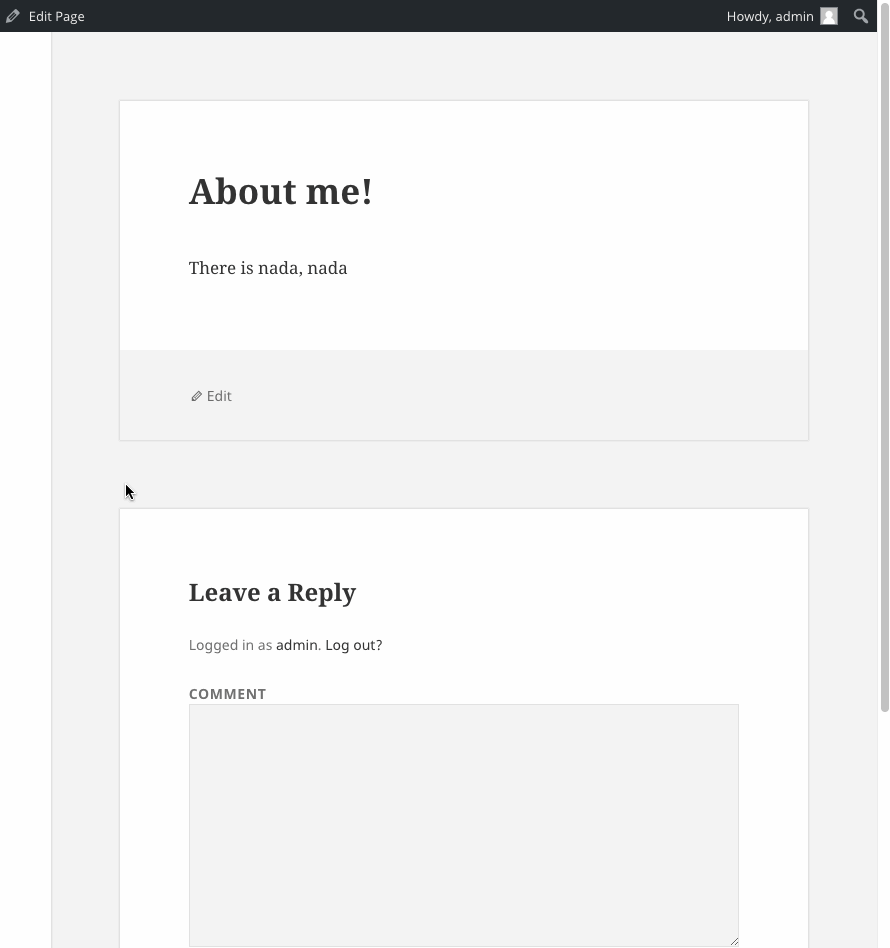
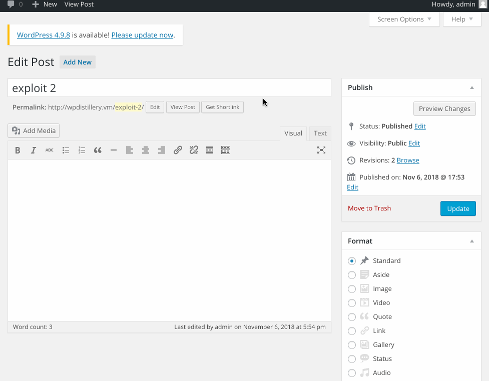
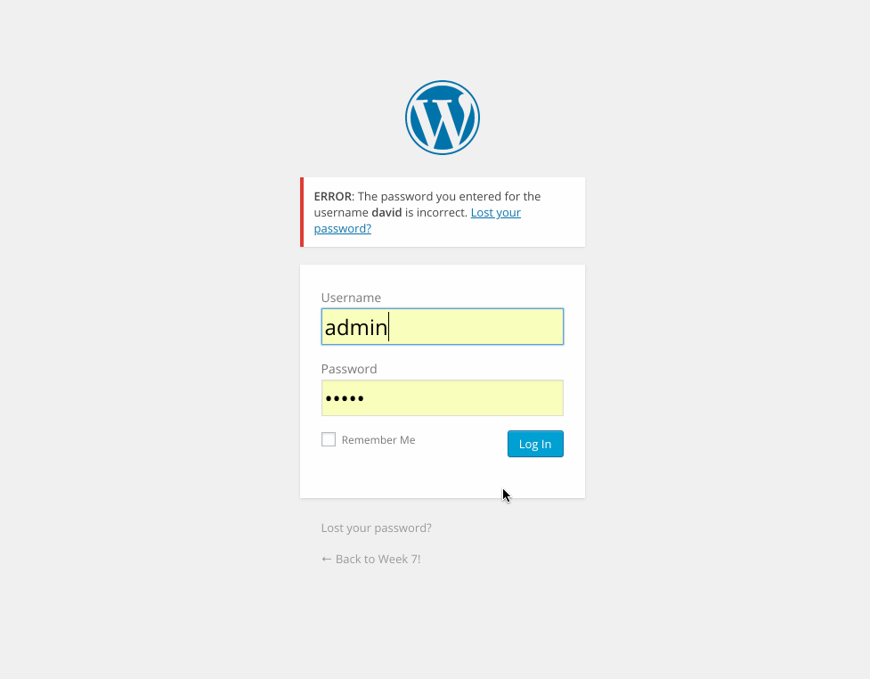

# Project 7 - WordPress Pentesting

Time spent: **6** hours spent in total

> Objective: Find, analyze, recreate, and document **five vulnerabilities** affecting an old version of WordPress

## Pentesting Report

1. Authenticated Shortcode Tags Cross-Site Scripting (XSS)
  - [x] Summary: 
    - Vulnerability types: XSS
    - Tested in version: 4.2
    - Fixed in version: 4.2.5
  - [x] GIF Walkthrough: 
  - [x] Steps to recreate: Comment as a admin or a editor authorization with the following 
        `<a href = "XSS" onmouseover=alert(1) rel="nofollow">CLICK ME!</a>`  
  - [x] Affected source code:
    - [Link 1](https://github.com/WordPress/WordPress/commit/f72b21af23da6b6d54208e5c1d65ececdaa109c8)

2. Authenticated Stored Cross-Site Scripting (XSS) in YouTube URL Embeds
  - [x] Summary: 
    - Vulnerability types:XSS
    - Tested in version: 4.2
    - Fixed in version: 4.2.13
  - [x] GIF Walkthrough: 
  - [x] Steps to recreate: Post comment with 
        `[embed src='https://www.youtube.com/embed/12345\x3csvg onload=alert(1)\x3e'][/embed]`
  - [x] Affected source code:
    - [Link 1](https://github.com/WordPress/WordPress/commit/419c8d97ce8df7d5004ee0b566bc5e095f0a6ca8)

3. User Enumeration
  - [x] Summary: 
    - Vulnerability types:XSS
    - Tested in version: 4.2
    - Fixed in version: 4.7.2
  - [x] GIF Walkthrough:  
  - [x] Steps to recreate: Login using different usernames and wrong password, and wordpress will verify if username exist
  - [x] Affected source code:
    - [Link 1](https://www.exploit-db.com/exploits/41497/)

## Assets

List any additional assets, such as scripts or files

## Resources

- [WordPress Source Browser](https://core.trac.wordpress.org/browser/)
- [WordPress Developer Reference](https://developer.wordpress.org/reference/)

GIFs created with [LiceCap](http://www.cockos.com/licecap/).

## Notes

Describe any challenges encountered while doing the work

## License

    Copyright [2018] [Jun Yu Cao]

    Licensed under the Apache License, Version 2.0 (the "License");
    you may not use this file except in compliance with the License.
    You may obtain a copy of the License at

        http://www.apache.org/licenses/LICENSE-2.0

    Unless required by applicable law or agreed to in writing, software
    distributed under the License is distributed on an "AS IS" BASIS,
    WITHOUT WARRANTIES OR CONDITIONS OF ANY KIND, either express or implied.
    See the License for the specific language governing permissions and
    limitations under the License.
